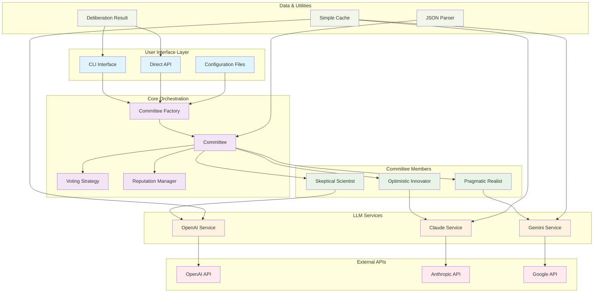
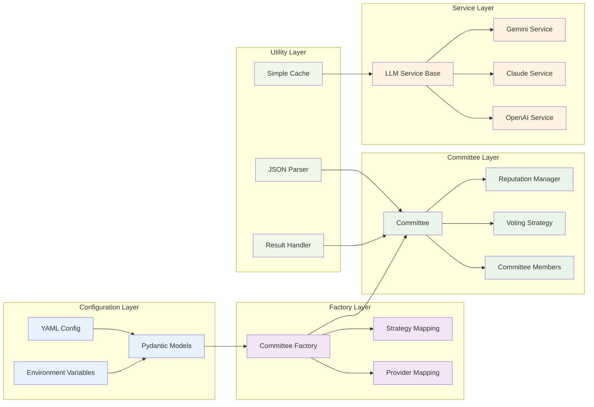
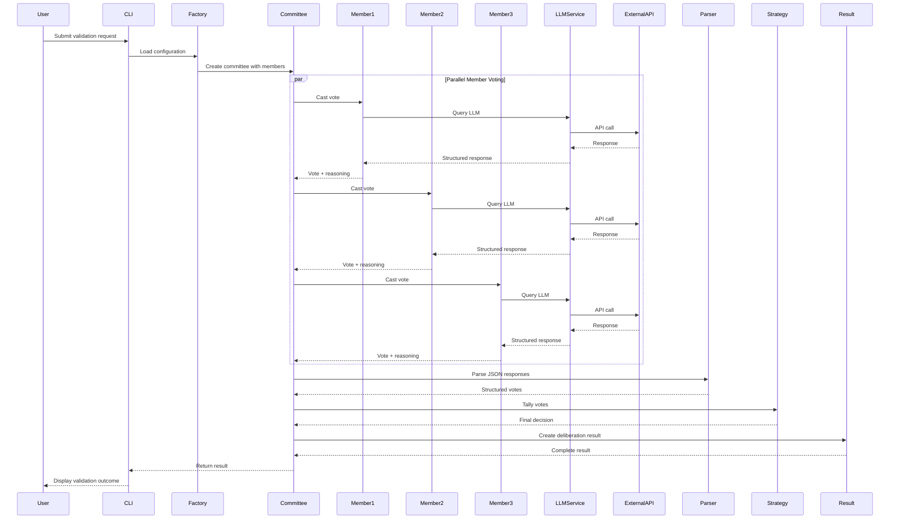
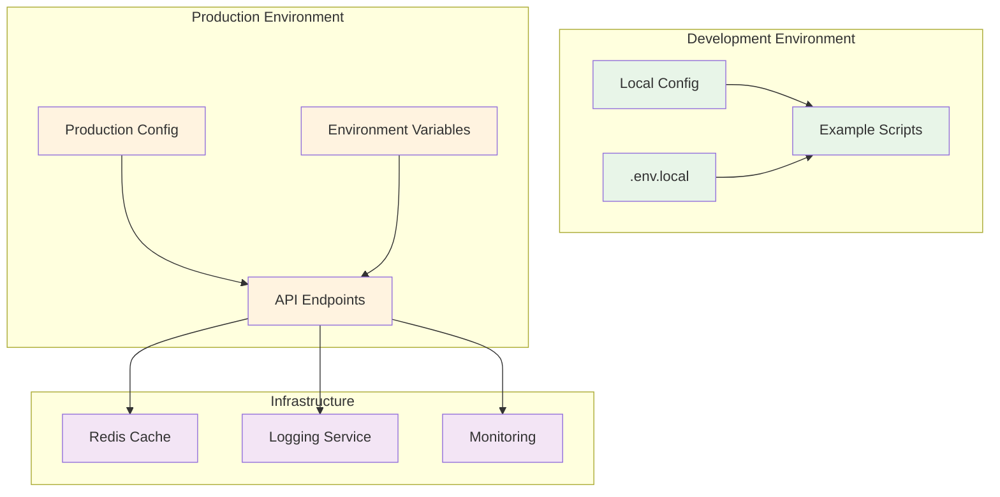

# 🏗️ Symposia Architecture Diagram

## System Overview

The Symposia framework implements a committee-based AI validation system that uses multiple LLM services to validate AI-generated content through structured deliberation and voting.

---

## High-Level Architecture

---

## Detailed Component Architecture

---

## Data Flow Architecture

---

## Component Details

### 🔧 Core Components

| **Component** | **Purpose** | **Key Features** |
|---------------|-------------|------------------|
| **Committee Factory** | Creates committees from configuration | Provider mapping, strategy selection |
| **Committee** | Orchestrates deliberation process | Member management, voting coordination |
| **Committee Member** | Individual AI expert | Role-based reasoning, vote casting |
| **Voting Strategy** | Aggregates member votes | Weighted majority, mean, median |
| **Reputation Manager** | Tracks member reliability | Adaptive scoring, consistency bonus |

### 🌐 Service Layer

| **Service** | **Provider** | **Capabilities** |
|-------------|--------------|------------------|
| **OpenAI Service** | OpenAI GPT models | Chat completions, token tracking |
| **Claude Service** | Anthropic Claude | Message API, system prompts |
| **Gemini Service** | Google Gemini | Content generation, token counting |

### 📊 Data Flow

1. **Configuration Loading**: YAML config → Pydantic models → Factory
2. **Committee Creation**: Factory → Committee with members and strategies
3. **Parallel Voting**: All members query LLMs simultaneously
4. **Response Parsing**: JSON parsing → Structured vote data
5. **Vote Aggregation**: Strategy → Final decision
6. **Result Generation**: Complete trace with reasoning and costs

### 🛡️ Error Handling

- **Graceful Cost Calculation**: Fallback to 0.0 on calculation errors
- **Retry Logic**: Exponential backoff for API failures
- **Caching**: Reduces API calls and improves performance
- **Validation**: Pydantic models ensure configuration integrity

---

## Deployment Architecture

---

*Architecture diagram generated for Symposia Committee Validation System*  
*Version: 1.0* 